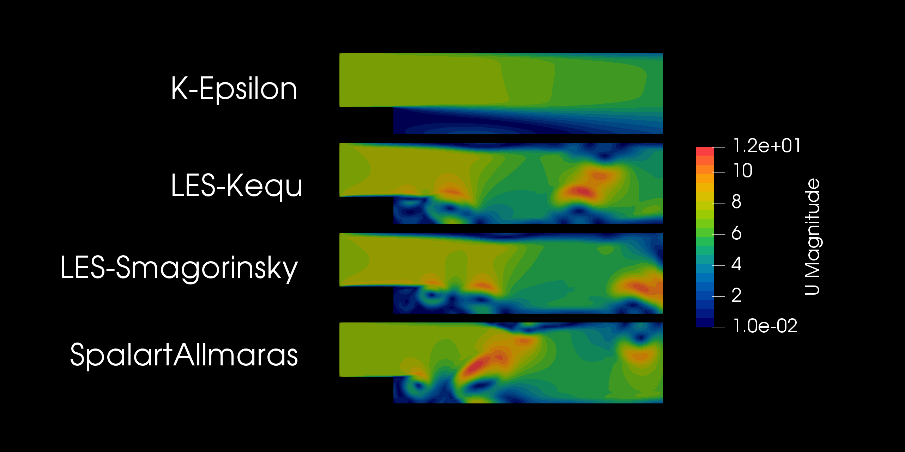

# Backward Step Turbulence Model Comparison

This project contains a set of OpenFOAM simulations analyzing the **backward-facing step** flow using different turbulence models. Each directory represents a separate simulation for a specific turbulence model, and the `comparison.png` image provides a visual summary of the results across all models.

## Turbulence models
- **/kEpsilon** - Simulation using the k-Epsilon turbulence model
- **/LRR** - Simulation using the LRR model
- **/SpalartAllmaras** - Simulation using the Spalart-Allmaras turbulence model
- **/LES** - Simulation using the LES Smagorinsky turbulence model
- **/Kequ** - Simulation using the LES Kequ turbulence model

## Objective
The objective is to evaluate and compare the effects of different turbulence models on the flow characteristics and show the turbulence model makes a difference. Key parameters such as recirculation length, velocity profile, and pressure distribution can be assessed to understand the suitability of each model for this type of flow by adding some functions to the one already present and/or using Paraview.

## How to Use
1. Navigate to each model’s directory to run each simulation by running ./Allrun (mesh already present).
2. Open `comparison.png` to visually compare the results across models.

## Requirements
- OpenFOAM installation. Tested on Openfoamv2312

